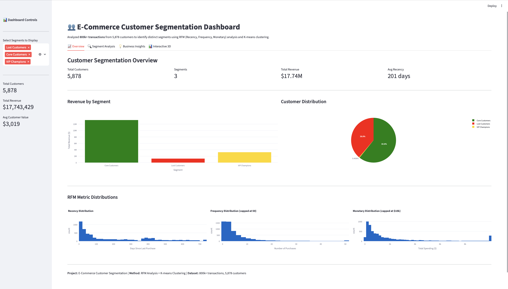
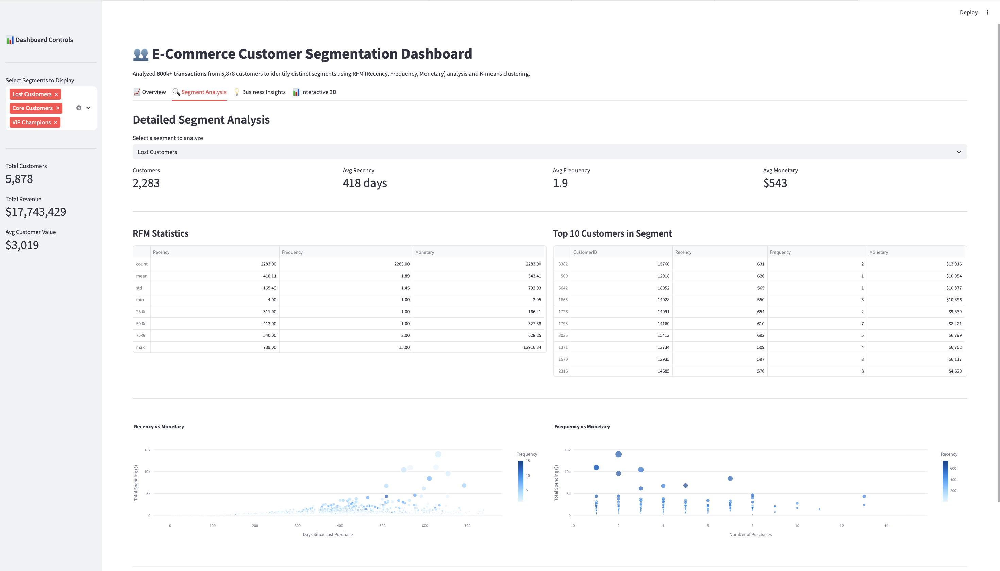
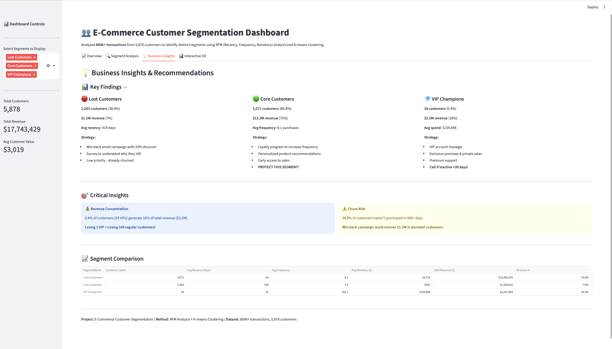
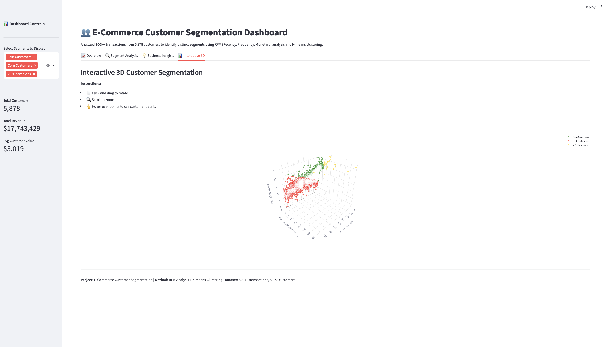

# E-Commerce Customer Segmentation Dashboard

An interactive analytics dashboard that segments 5,878 e-commerce customers into distinct behavioral groups using RFM (Recency, Frequency, Monetary) analysis and machine learning clustering. This project analyzed over 800,000 transactions to identify actionable customer segments and enable data-driven marketing strategies.

## Project Overview

Customer segmentation is critical for effective marketing and retention. This project uses transactional data from an online retail business to identify three distinct customer groups based on purchasing behavior. The analysis reveals significant revenue concentration, with just 24 customers (0.4% of the customer base) generating 18% of total revenue.

The interactive dashboard enables marketing teams to explore customer segments, understand their characteristics, and develop targeted strategies for each group.

## Key Findings

**Three distinct customer segments emerged from the analysis:**

**VIP Champions (24 customers, 0.4% of base)**
- Generate $3.2 million in revenue (18% of total)
- Purchase frequency: 152 times on average
- Last purchase: 21 days ago on average
- These customers require premium service and personal attention

**Core Customers (3,571 customers, 60.8% of base)**
- Generate $13.3 million in revenue (75% of total)
- Purchase frequency: 8 times on average
- Last purchase: 64 days ago on average
- The backbone of the business, requiring retention focus

**Lost Customers (2,283 customers, 38.8% of base)**
- Generated $1.2 million in revenue (7% of total)
- Purchase frequency: 2 times on average
- Last purchase: 418 days ago on average
- Significant churn; potential win-back opportunity

**Critical Business Insights:**
- Losing one VIP customer has the same revenue impact as losing 149 regular customers
- Over one-third of customers have been inactive for over a year
- Customer lifetime value varies dramatically by segment: from $543 (Lost) to $134,898 (VIP)

## Dashboard Screenshots

**Overview Dashboard**


The overview provides high-level metrics including customer distribution across segments, total revenue by segment, and the distribution of RFM metrics across the customer base.

**Segment Analysis**


Detailed analysis view allows exploration of individual segments, showing top customers, statistical summaries, and behavioral patterns within each group.

**Business Insights**


Strategic recommendations for each segment with clear action items and priority levels based on revenue impact and customer value.

**Interactive 3D Visualization**


Fully interactive three-dimensional visualization of customer segments in RFM space. Users can rotate, zoom, and hover over individual customers to see detailed information.

## Technical Implementation

**Data Processing Pipeline:**
1. Loaded and combined two years of transaction data (1M+ records)
2. Cleaned data by removing transactions without customer IDs, cancelled orders, and erroneous entries
3. Calculated RFM metrics for each customer
4. Applied K-means clustering algorithm to identify natural customer groupings
5. Validated cluster quality using silhouette analysis

**Machine Learning Approach:**
- Used K-means clustering with standardized features
- Tested cluster counts from 2 to 10
- Selected 3 clusters based on silhouette score optimization (0.4426) and business interpretability
- Applied log transformation to monetary values to handle extreme outliers

**Dashboard Features:**
- Real-time filtering by customer segment
- Interactive visualizations with drill-down capabilities
- Statistical summaries and top customer identification
- Three-dimensional cluster visualization with hover details

## Technology Stack

- **Python 3.13** for all data processing and analysis
- **Pandas and NumPy** for data manipulation
- **Scikit-learn** for K-means clustering and feature scaling
- **Plotly** for interactive visualizations
- **Streamlit** for dashboard development and deployment
- **Matplotlib and Seaborn** for exploratory data analysis
- **Jupyter Notebooks** for iterative analysis and documentation

## Project Structure
```
customer-segmentation-dashboard/
├── data/
│   ├── raw/                    # Original transaction data
│   └── processed/              # Cleaned data and RFM calculations
├── src/
│   └── dashboard.py            # Streamlit dashboard application
├── notebooks/
│   └── 01_customer_segmentation_exploration.ipynb
├── images/                     # Dashboard screenshots
├── requirements.txt            # Python dependencies
└── README.md
```

## Installation and Usage

**Prerequisites:**
- Python 3.8 or higher
- pip package manager

**Setup Instructions:**

1. Clone the repository:
```bash
git clone https://github.com/Spandycodes25/customer-segmentation-dashboard.git
cd customer-segmentation-dashboard
```

2. Create a virtual environment:
```bash
python3 -m venv venv
source venv/bin/activate  # On Mac/Linux
# OR
venv\Scripts\activate  # On Windows
```

3. Install required packages:
```bash
pip install -r requirements.txt
```

4. Launch the dashboard:
```bash
streamlit run src/dashboard.py
```

The dashboard will automatically open in your default web browser at `http://localhost:8501`.

## Methodology

**RFM Analysis Framework:**

RFM is a proven marketing analysis technique that segments customers based on three key behavioral metrics:

- **Recency**: How recently did the customer make a purchase? (measured in days since last transaction)
- **Frequency**: How often does the customer purchase? (count of unique transactions)
- **Monetary**: How much does the customer spend? (total spending across all transactions)

**Clustering Process:**

1. Calculated RFM metrics for all 5,878 customers
2. Standardized features to ensure equal weighting (mean=0, std=1)
3. Applied K-means algorithm with multiple cluster counts
4. Evaluated cluster quality using:
   - Within-cluster sum of squares (elbow method)
   - Silhouette coefficient (cluster separation)
   - Business interpretability

Selected three clusters as optimal based on statistical metrics and practical business application.

## Business Recommendations

**Lost Customers Strategy:**
These customers have already churned but represent a recovery opportunity. Recommended approach includes win-back email campaigns with promotional offers, customer satisfaction surveys to understand departure reasons, and segmented messaging based on their historical purchase patterns. Given their low current value, this segment should receive automated marketing efforts rather than manual outreach.

**Core Customers Strategy:**
This segment drives the majority of revenue and requires careful retention. Implement loyalty programs with tiered benefits, develop personalized product recommendation engines, provide early access to new products and sales, and establish regular engagement touchpoints. Monitor this segment closely for signs of decreased engagement, as preventing churn here is far more valuable than recovering lost customers.

**VIP Champions Strategy:**
These high-value customers justify premium treatment. Assign dedicated account managers, offer exclusive previews and private shopping experiences, provide priority customer service, and implement proactive monitoring to detect any decrease in engagement. Consider personal outreach if a VIP customer hasn't purchased within 30 days, as the revenue impact of losing even one VIP customer is substantial.

## Dataset Information

**Source**: Online Retail II Dataset from the UCI Machine Learning Repository

**Scope**: 
- Transaction period: December 2009 through December 2011
- Original records: 1,067,371 transactions
- Cleaned records: 805,549 transactions
- Unique customers: 5,878
- Total revenue: $17.7 million
- Geographic focus: United Kingdom (92% of transactions)

**Data Quality**: 
Applied rigorous cleaning procedures including removal of transactions without customer identifiers (23% of records), elimination of cancelled orders and returns, and filtering of data quality issues such as negative or zero prices.

## Future Development

Several extensions would enhance this analysis:

- **Churn Prediction**: Build predictive models to identify Core Customers at risk of becoming Lost Customers
- **Cohort Analysis**: Track customer lifetime value and behavior changes over time
- **Revenue Forecasting**: Develop time-series models to predict future revenue by segment
- **Campaign Attribution**: Integrate marketing campaign data to measure segment-specific response rates
- **Real-time Updates**: Connect to live transaction data for continuous segmentation updates

## Author

**Spandan Surdas**

Data Science Graduate Student at Northeastern University (expected graduation May 2027). Background in healthcare machine learning with published research in IEEE and Springer journals. Previously developed antimicrobial resistance prediction systems at Medtigo achieving 92% accuracy.

- LinkedIn: https://www.linkedin.com/in/s-spandan
- Portfolio: https://spandansurdas.vercel.app/
- Email: spandan.surdas25@gmail.com

## Acknowledgments

This project builds on established marketing analytics frameworks and leverages the Online Retail II dataset from the UCI Machine Learning Repository. The analysis methodology draws from customer segmentation best practices in e-commerce and retail analytics.

## License

This project is open source and available under the MIT License.